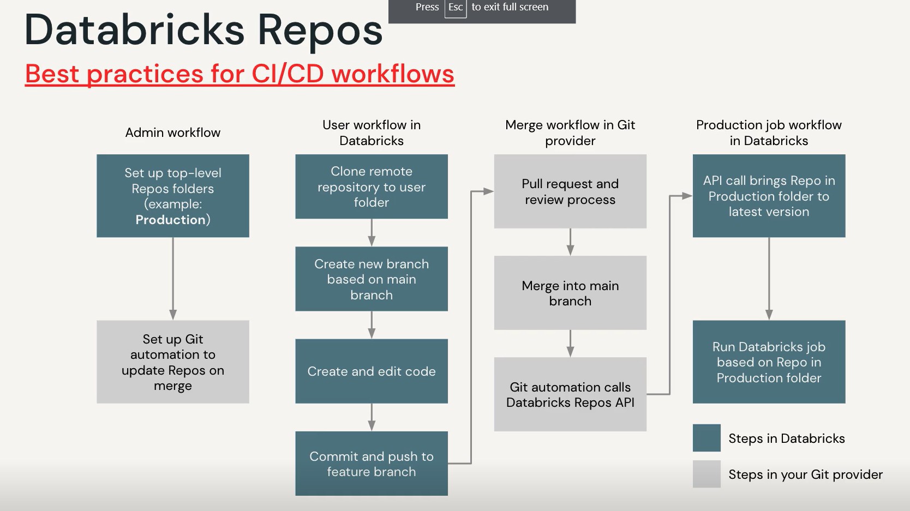

# Data Engineering with Databricks

## Objectives

- [ ] Leverage the Databricks Lakehouse Platform to perform core responsibilities for data pipeline development
- [ ] Use SQL and Python to write production data pipelines to extract, transform, and load data into tables and views in the Lakehouse
- [ ] Simplify data ingestion and incremental change propagation using Databricks-native features and syntax, including Delta Live Tables
- [ ] Orchestrate production pipelines to deliver fresh results for ad-hoc analytics and dashboarding

## Lakehouse

- One simple platform to unify all data, analytics, and AI Workloads
- Open source
  - Spark
  - Delta Lake
  - MlFlow
- Half of Fortune 500 - transformative change for companies
- Problems
  - Isolated stacks for data warehousing, engineering, streaming, data science / ML
  - Disconnected and stacked and different tools used for each step
  - Different versions of the truth
  - Many copies of data
  - No overarching
- Data **Lakehouse**
  - Bridges the gap between a Data Lake
  - And a Data Warehouse
  - One platform to unify all data, analytics, and AI
- Delta lake
  - ACID transactions
  - Data governanev at scale
  - Spark - fast processing
  - Access control
  - Simple, open, and collaborative
- Data can remain in datalake
- koalas, redash - commitment to open source. Open technology no lockdovn
- Over 450 partners for ML governance, data
- Collaborative
  - Analysts, engineers, datascientists can work together on models, dashboards, notebooks, and datasets

## Databricks Architecture and Services

- Data storage layer on top of a data lake that offers the conveniences of a data warehouse
- Computational resources performed on databriacks clusters in notebooks or as jobs
- Live in the data plane with the cloud account
- Clusters >= 1 VM instances with 
  - All Purpose
    - ANalyze collaboratively with notebooks
  - Job Custers
    - Run automated jobs

## Web interface

### Sidebar

- Persona switcher - DB SQL / ML / DS & E
- Create notebooks, tables, clusters, and jobs
- Workspace - navigates file systems
- Repos
- Recents - recently used assets
- Data - browse assets in workspace / DBFS
- Compute - Create and manage clusters
- Jobs - create and manage jobs and popelines
- Partner connect - partner integrations
- Help - documentation, community support, etc
- Settings - tokens, git integration, etc

---

## Get Versioning with Databricks Repos

- Basic version control
- Native integration with GitHub
- CI/CD Integration
- Clone / pull / branch



- Do I want a premium plan for git integration? Was trying to set up 14-day free trial but was running into problams with existing accounts and access.
- Will watch video for now and do this when I have a real account

## Delta Lake

- Delta lake is **NOT**
  - A proprietary technology
  - Storage format
  - Storage medium
  - Database service or data warehouse
- **IS**
  - Open-source project delta.io
  - Builds on standard data formats - parquet standard, uses JSON
  - Optimized for cloud object storage
    - cheap, durable, scalable
  - Built for scalable metadata handling
    - Decouples compute and storage costs
  - ACID transactions - atomicity, consistency, isolation, durability
  - Micro-batch, near real time processing
  
## DE 2.1 Managing Delta Tables Notebook

### Create

```sql
CREATE TABLE IF NOT EXISTS students 
  (id INT, name STRING, value DOUBLE)
```

### Insert

```sql
INSERT INTO students
VALUES 
  (4, "Ted", 4.7),
  (5, "Tiffany", 5.5),
  (6, "Vini", 6.3)
  ```

### Update

```sql
UPDATE students 
SET value = value + 1
WHERE name LIKE "T%"
```

### Delete

```sql
DELETE FROM students 
WHERE value > 6
```

### Temp table

```sql
CREATE OR REPLACE TEMP VIEW updates(id, name, value, type) AS VALUES
  (2, "Omar", 15.2, "update"),
  (3, "", null, "delete"),
  (7, "Blue", 7.7, "insert"),
  (11, "Diya", 8.8, "update");
  
SELECT * FROM updates;
```

### Merge

- `MERGE` for `UPCERT` - `UPDATE`, `INSERT`, `DELETE`
- Matching condition like `JOIN` 

```sql
MERGE INTO students b
USING updates u
ON b.id=u.id
WHEN MATCHED AND u.type = "update"
  THEN UPDATE SET *
WHEN MATCHED AND u.type = "delete"
  THEN DELETE
WHEN NOT MATCHED AND u.type = "insert"
  THEN INSERT *
```

### Drop

```sql
DROP TABLE students
```

---

## DE 2.2L Manipulate Tables with Delta Lakes Lab

